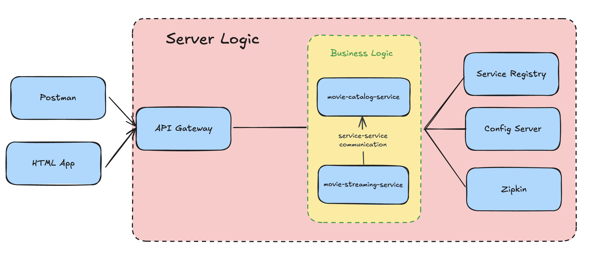

# VideoStreaming Platform

[](https://spring.io/projects/spring-boot)
[](https://microservices.io/)
[](https://www.oracle.com/java/)
[](LICENSE)

A modern, microservices-based video streaming platform built with Spring Boot. This application demonstrates a scalable architecture for delivering video content through a distributed system approach.

## 📋 Table of Contents

- [Project Overview](#project-overview)
- [Architecture](#architecture)
- [Features](#features)
- [Technologies Used](#technologies-used)
- [Setup Instructions](#setup-instructions)
- [Usage](#usage)
- [API Documentation](#api-documentation)
- [Contributing](#contributing)
- [License](#license)

## 🔭 Project Overview

VideoStreaming Platform is a scalable, cloud-native application designed to stream video content efficiently. The platform uses a microservices architecture to handle different responsibilities separately, allowing for better scalability, maintenance, and deployment.

The system provides a simple and intuitive interface for users to browse and stream videos while handling the complexities of video delivery through its backend services.

## 🏗️ Architecture



The application follows a microservices architecture with the following components:

1. **API Gateway (Port: 8080)**
   - Entry point for all client requests
   - Routes requests to appropriate microservices
   - Handles authentication and request filtering

2. **Service Registry (Eureka Server) (Port: 8761)**
   - Enables service discovery
   - Tracks all microservice instances and their health
   - Allows services to find and communicate with each other without hardcoded URLs

3. **Config Server (Port: 8888)**
   - Centralizes configuration for all services
   - Provides environment-specific configurations
   - Allows runtime configuration updates

4. **Movie Catalog Service**
   - Manages movie metadata (title, description, genre)
   - Provides APIs for browsing and searching movies
   - Stores information about video locations and formats

5. **Movie Streaming Service**
   - Handles the core video streaming functionality
   - Manages video delivery using appropriate streaming protocols
   - Optimizes video quality based on client capabilities

6. **Web Frontend**
   - Simple, responsive HTML/JavaScript interface
   - Displays video cards for browsing
   - Embeds video player for streaming content

## ✨ Features

- **Video Streaming**: Stream videos with adaptive bitrate capabilities
- **Service Discovery**: Automatic detection and registration of microservices
- **Centralized Configuration**: Management of application properties from a single location
- **Responsive UI**: Simple interface that works across devices
- **Catalog Browsing**: Browse available videos with metadata
- **Scalable Architecture**: Independent scaling of services based on demand
- **Fault Tolerance**: Resilient design that handles service failures gracefully

## 🚀 Technologies Used

- **Backend**:
  - Java 11+
  - Spring Boot
  - Spring Cloud
  - Spring Cloud Netflix (Eureka)
  - Spring Cloud Config
  - Spring Cloud Gateway
  - RESTful APIs

- **Frontend**:
  - HTML5
  - CSS3
  - JavaScript
  - Video.js (for video player)

- **Build Tools**:
  - Gradle

- **Other Tools**:
  - Git (version control)
  - Docker (containerization)

## 🔧 Setup Instructions

### Prerequisites

- Java 11 or higher
- Gradle
- Git
- Docker (optional, for containerized deployment)

### Clone the Repository

```bash
git clone https://github.com/yourusername/video-streaming-platform.git
cd video-streaming-platform
```

### Start the Services

The services should be started in the following order:

1. Config Server
```bash
cd config-server
./gradlew bootRun
```

2. Service Registry
```bash
cd service-registry
./gradlew bootRun
```

3. Movie Catalog Service
```bash
cd movie-catalog-service
./gradlew bootRun
```

4. Movie Streaming Service
```bash
cd movie-streaming-service
./gradlew bootRun
```

5. API Gateway
```bash
cd api-gateway
./gradlew bootRun
```

### Using Docker (Alternative)

If you prefer using Docker:

```bash
# Build all services
./gradlew build

# Start using Docker Compose
docker-compose up
```

## 📝 Usage

1. Open your browser and navigate to `http://localhost:8080`
2. Browse the available videos from the catalog
3. Click on a video to start streaming
4. Use the video player controls to manage playback

### Service Endpoints

- **Eureka Dashboard**: `http://localhost:8761`
- **API Gateway**: `http://localhost:8080`
- **Movie Catalog Service**: `http://localhost:8080/catalog`
- **Movie Streaming Service**: `http://localhost:8080/stream`

---

Developed with ❤️ by [Your Name]

